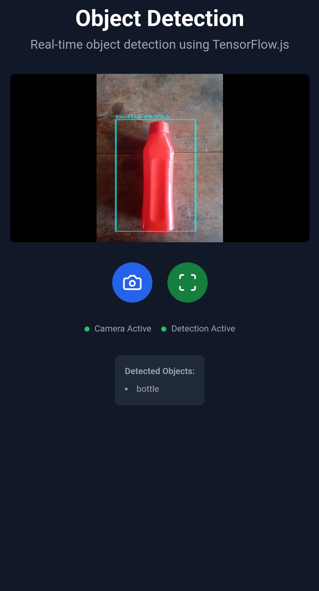
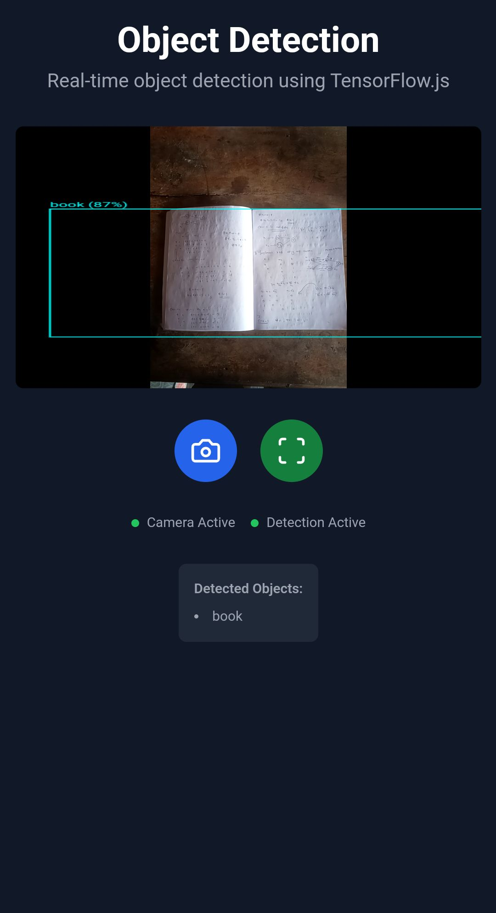

# Real-Time Object Detection Web App

A modern web application that performs real-time object detection using TensorFlow.js and the COCO-SSD model. This application runs entirely in the browser, utilizing your device's camera to detect and identify objects in real-time.

## Features

- 📸 Real-time camera feed processing
- 🔍 Object detection with bounding boxes
- 📊 Confidence score display
- 📱 Responsive design for mobile and desktop
- ⚡ Fast performance using TensorFlow.js
- 🎯 Easy-to-use interface with clear status indicators

## Technology Stack

- **Frontend Framework**: React with TypeScript
- **Styling**: Tailwind CSS
- **Icons**: Lucide React
- **ML Model**: TensorFlow.js with COCO-SSD
- **Build Tool**: Vite

## Object Detection Model

This project uses the COCO-SSD (Common Objects in Context - Single Shot MultiBox Detection) model, specifically the `lite_mobilenet_v2` version for optimal performance. The model can detect 80 different types of objects, including:

- People
- Vehicles (cars, trucks, bicycles)
- Animals (dogs, cats, birds)
- Common objects (chairs, tables, phones)
- And many more

The model provides:

- Object classification
- Bounding box coordinates
- Confidence scores for each detection

## Getting Started

1. Clone the repository
2. Install dependencies:
   ```bash
   npm install
   ```
3. Start the development server:
   ```bash
   npm run dev
   ```
4. Open your browser and allow camera access when prompted

## Usage

1. Click the camera icon to activate your device's camera
2. Click the scan icon to start object detection
3. Objects will be automatically detected and highlighted with bounding boxes
4. Each detection includes the object class and confidence percentage
5. View the list of detected objects below the video feed

## Performance Considerations

- The application uses the lightweight MobileNet V2 backbone for faster inference
- Real-time detection runs in an optimized animation loop
- Canvas rendering is efficiently managed to prevent memory leaks
- The model is loaded asynchronously to prevent blocking the main thread

## Browser Compatibility

The application requires:

- Modern browser with WebGL support
- Camera/webcam access
- JavaScript enabled
- Sufficient processing power for real-time detection

## Privacy

- All processing is done locally in your browser
- No images or video data are sent to any server
- Camera access is only requested when explicitly enabled by the user

## License

MIT License - feel free to use this project for personal or commercial purposes.

## Contributing

Contributions are welcome! Please feel free to submit a Pull Request.

## Example

 
